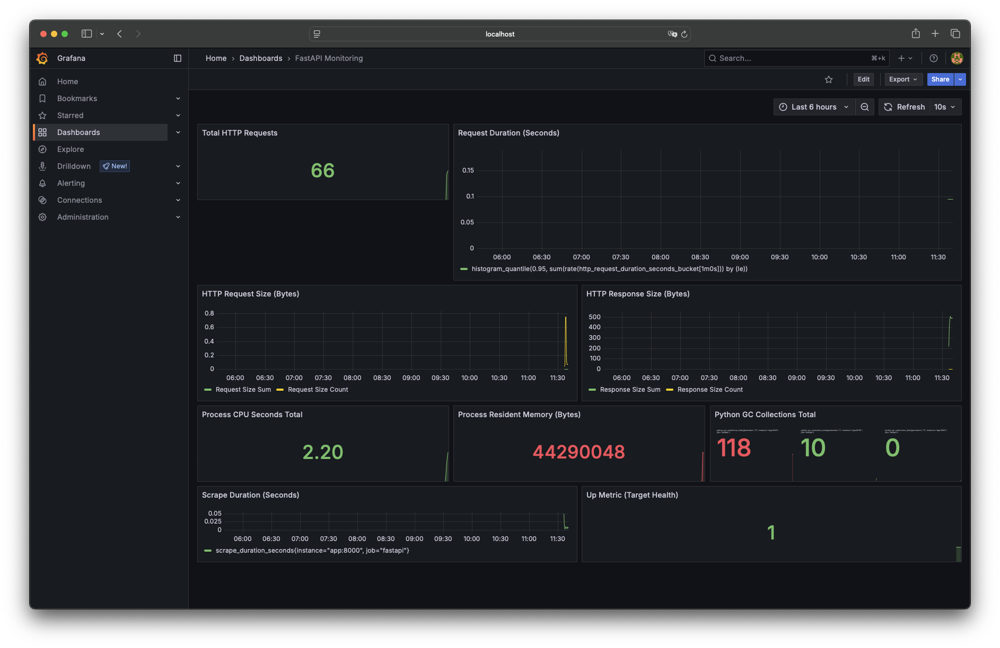

# FastAPI Monitoring with Prometheus & Grafana

This repository provides a ready-to-use example of deploying a simple FastAPI application instrumented with Prometheus metrics, alongside a basic monitoring stack using Prometheus and Grafana.



## Get Started

1. **Clone the repository**:

   ```bash
   git clone git@github.com:fabienchevalier/simple-api-grafana-monitoring.git
    cd simple-api-grafana-monitoring
    ```

2. **Start the stack**:

   ```bash
   docker compose up --build
   ```

- FastAPI app: <http://localhost:8000>

- Prometheus: <http://localhost:9090>

- Grafana: <http://localhost:3000> (default login: admin / admin)

3. Make request to the FastAPI app to populate the metrics:

   ```bash
   while true; do
    curl -s http://localhost:8000/ > /dev/null
    echo "Request sent"
    sleep 1

   done
    ```
